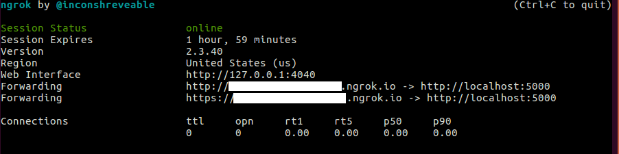
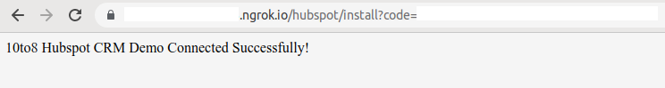

# 10to8 Enterprise API HubSpot CRM Demo
Example CRM integration for syncing __Contacts__ between [__10to8__](https://10to8.com) and [__HubSpot__](https://www.hubspot.com/) using the [__10to8 Enterprise API.__](https://10to8.com/api/enterprise/v2/)

This demo suppliments the [__10to8 Enterprise API Documentation__](https://10to8.com/api/enterprise/v2/), illustrating how 10to8's Enterprise API can be used to integrate a 3rd Party system.
* See the [Notes](#notes) for details of some of the known limitations of this demo.

# Installation
## Prerequisites
* [python 3.7](https://www.python.org/downloads/release/python-370/) or above
* [pip](https://pypi.org/project/pip/)
* [python venv](https://docs.python.org/3.7/library/venv.html#module-venv)
* [ngrok](https://ngrok.com/)

## HubSpot Account Configuration
* Sign up for a [HubSpot app developer account](https://app.hubspot.com/signup/developers/step/user-info)
* Create a hubspot app with your hubspot developer account
  * See [How do I create an app in HubSpot](https://legacydocs.hubspot.com/docs/faq/how-do-i-create-an-app-in-hubspot)
* Create a hubspot test account.
  * (This is where you'll be syncing customer details to and from.)
  * See [How do I create a test account in HubSpot](https://legacydocs.hubspot.com/docs/faq/how-do-i-create-a-test-account)

## Create Virtual Env and Install Dependencies
From the root of this repo:
```
python -m venv venv
source ./venv/bin/activate
python -m pip install -r requirements.txt
```

## API Keys
Obtain API keys from 10to8 and HubSpot, and put them into `src/config.py`
 * Get your 10to8 Enterprise API key from the [10to8 Enterprise API Key Manager](https://10to8.com/api/enterprise/v2/manage-keys/)
   * Update `src/config.py`: `TTE_ENTERPRISE_API_KEY="yyy"`
 * Get your Hubpsot Developer API key:
   * See [HubSpot Developer API keys](https://legacydocs.hubspot.com/docs/faq/developer-api-keys)
    * Update `src/config.py`: `HUBSPOT_DEVELOPER_API_KEY="xxx"
 * Get the API key from your hubspot test account you created earlier - see [HubSpot Account Configuration/Setup](#hubspot-account-configuration) :
   * See [How do I get my hubspot API key](https://knowledge.hubspot.com/integrations/how-do-i-get-my-hubspot-api-key)
   * Update `src/config.py`: `HUBSPOT_API_KEY="xxxxxx"
 * Create a hubspot app with a hubspot developer account, acquire the following, and update `src/config.py`:
   * HUBSPOT_APP_ID = "App ID"
     * See [How do I find the app ID in HubSpot](https://legacydocs.hubspot.com/docs/faq/how-do-i-find-the-app-id)
   * HUBSPOT_CLIENT_ID = "Client ID"
     * See Auth settings section of [How do I create an app in HubSpot](https://legacydocs.hubspot.com/docs/faq/how-do-i-create-an-app-in-hubspot)
   * HUBSPOT_CLIENT_SECRET = "Client Secret"
     * See Auth settings section of [How do I create an app in HubSpot](https://legacydocs.hubspot.com/docs/faq/how-do-i-create-an-app-in-hubspot)
  * In your HubSpot App, add the following scopes using the search box to find and enable each of these scope:
    * _See the bottom of [How do I create an app in HubSpot](https://legacydocs.hubspot.com/docs/faq/how-do-i-create-an-app-in-hubspot) to find your HubSpot App's scopes._
    * `crm.objects.contacts.write`
    * `crm.objects.contacts.read`
    * `oauth`
    * Note: If the scopes above are not available:
      * Add `contacts` to your OAuth Scopes for your app
      * Update config.py with HUBSPOT_SCOPES="contacts"

## Start Flask Server
Use ngrok to allow your local flask server to be visible to 10to8 and hubspot
 * Start ngrok to obtain your temporary host for your webserver
    * `ngrok http 5000`
    * Update WEBHOOK_HOST in `src/config.py` with the https URL allocated by ngrok
    * Update your hubspot app's redirect URL with a `https://xxxxxx.ngrok.io/hubspot/install`, (replace xxx.ngrok.io with the URL allocated by ngrok).
      

For subscription notifications/webhooks, you'll need to start a flask server:
  * Start your flask server:
```
cd src
export FLASK_APP=subscriptions.py
flask run
```

## Register HubSpot App
You'll need a flask server running for this step to work (see above).
  * Register the app with your HubSpot demo account instance:
    * Open this page on your flask server: http://127.0.0.1:5000/hubspot/start
    * This will redirect to the HubSpot app regisitration flow
     * Select the HubSpot test account you want to register this app with
     * This should redirect to a final page showing success.
      
     * _For more details on the app installation process, see 'How to install an app in [Creating a HubSpot App](https://developers.hubspot.com/docs/api/creating-an-app)_

Troubleshooting: if you have trouble with the auth flow, try the following:
  * Find your HubSpot App's Auth Settings and check your settings - see below
     * see "Auth settings" section in [Creating a HubSpot app](https://developers.hubspot.com/docs/api/creating-an-app).
     * Check your HubSpot App's scopes are listed correctly in `HUBSPOT_SCOPES` in `config.py`, and retry by opening http://127.0.0.1:5000/hubspot/start
       * Recent HubSpot App registrations
          * config.py: `HUBSPOT_SCOPES="crm.objects.contacts.write crm.objects.contacts.read oauth"`
          * Check that your HubSpot App's scopes are correct in the HubSpot App settings Auth page and match the scopes listed  config.py.
        * Legacy HubSpot App registrations should use the following:
          * config.py: `HUBSPOT_SCOPES="contacts"`
          * Check that your HubSpot App's scopes are correct in the HubSpot App settings Auth page and match the scopes listed  config.py.
   * If it still doesn't work, try copying and open the "Install URL (OAuth) from the Auth settings of your HubSpot App.
     * see "Auth settings" section in [Creating a HubSpot app](https://developers.hubspot.com/docs/api/creating-an-app).

## Run setup.py
Before you are ready to perform any syncing, you'll need to run the following script:
  * Run setup.py to configure your setup:
      * Creates subscriptions in 10to8
      * Creates subscriptions in HubSpot
      * Sets up a custom field in HubSpot to store the 10to8 Customer URI.
```
cd src
python -m setup

```

## Configure HubSpot to show new fields created
The setup step above creates some new fields in HubSpot, such as `10to8 Customer Sync Status`.
To view them more conveniently in HubSpot, see these instructions:
* [HubSpot - Select properties to show under the About section](https://knowledge.hubspot.com/contacts/select-properties-to-show-under-the-about-section-in-a-record)
You can also customise which properties you show on your HubSpot contacts home - see:
* [HubSpot - guide to contacts index page](https://knowledge.hubspot.com/contacts/a-guide-to-your-contacts-home)

## How to Update your ngrok URL (when your ngrok session expires)
  * Your webhooks are now live - your sync should be active for as long as your ngrok URL is valid (usually a few hours).
     * When your ngrok URL expires, you'll need to restart ngrok to get a new URL, and then:
       * Update config.py: `WEBHOOK_HOST`
       * Update the redirect URL for your hubspot app
       * Restart your flask server
       * Re-run the setup script to update the webhook URLs in hubspot and 10to8.


# Manual syncs
Manually start a full inbound sync (from HubSpot into 10to8):
```
cd src
python -m inbound_sync
```
Manually start a outbound inbound sync (from 10to8 into HubSpot):
```
cd src
python -m outbound_sync
```

# Live syncing
For subscription notifications/webhooks, you'll need to start a flask server.
Make sure that you've performed all of the set up steps first.
  * Start your flask server:
```
cd src
export FLASK_APP=subscriptions.py
flask run
```
You should be able to monitor any syncing happening via the log output from the flask server.

# Notes
The purpose of this demo is to illustrate how 10to8's Enterprise API can be used to build a CRM integration.
* As a demo, this is not intended to be a production-ready system.
  * This demo errs towards simplicity to serve its purpose to illustrate how to use 10to8's APIs.
* Some of the limitations of this demo are outlined below (this is not a comprehensive list).

## Fields
This demo syncs a subset of the fields available on the 10to8 API have been chosen for syncing.
* Here is a mapping between 10to8's fields and HubSpot's fields:
  * "name" field -> "firstname", "lastname"
  * "emails" -> "email", "tte_customer_secondary_emails"
  * "numbers" -> "phone", "tte_customer_secondary_phone"
* Sync status/Error messages are written to:
  * 10to8 Custom field: "Sync Status"
  * HubSpot: "tte_customer_sync_status"
* The External System's ID is written to:
  * 10to8 Custom field: "External ID"
  * HubSpot: "tte_customer_uri"

## Deleting Customers
* 10to8 provides a means of intervening if a deletion will result in a customer with future bookings being deleted.
  * https://10to8.com/api/enterprise/v2/#operation/patch-api-enterprise-v2-customer-id
  * For simplicity this demo is not making use of this mechanism - we've disabled the conflict detection with `force=True` on the Customer Delete endpoint.
  * When building your integration you may wish to add a mechanism to handle this situation.
* We've not integrated with HubSpot's GDPR endpoints, as they are in Beta and subject to change.
  * https://developers.hubspot.com/docs/api/crm/contacts


## How to handle when the external system has stricter validation constraints
* If the external system is stricter, we can:
  * Find a placeholder to put into the external system
  * Write an error message into the Sync Status field
  * Block overwriting of invalid content in 10to8 if it matches the placeholder

In our example, we demonstrate how to handle this with the primary email field.
For example HubSpot is more restrictive than 10to8 with email address validation for the primary email field.
* In our example, we:
  * Use an empty string "" as our placeholder in HubSpot for invalid emails
  * Write an error message containing the invalid email into the Sync Status field
  * Block overwriting of the invalid email if the primary email matches our placeholder, an empty string "".

## Webhooks
For simplicity, this demo does not restrict access to the webhook callback URLs hosted on this flask server.
For a production environment, the following may be worth considering:
* Adding basic authentication to your callback URLs used for your webhooks
* Restricting IP ranges to only the services you're expecting

### Use async handling or 10to8 will timeout and retry
* 10to8's Subscription Notification webhooks require a response within 5 seconds.
  * https://10to8.com/api/enterprise/v2/#tag/Subscriptions
  * For simplicity, this demo is handling these asynchronously using multiprocessing
  * In a production environment, a task queue such as [Celery](https://docs.celeryproject.org) is recommended.


## Key Management
To configure this demo for use, API keys are stored in a config file.
* In a production environment, consider using a secure secret management system instead.
